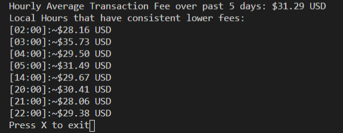

# ETH-Fee-Time-Tool
Find the best time to make ETH transactions!
Utilizing flipsidecrypto VELOCITY database: https://app.flipsidecrypto.com/shareable/timing-for-claiming-rewards-bqT2Cu 

## What is the best time to make your transaction?
This tool takes the average transaction fee (USD) over the past 5 days.
* Utilizing flipsidecrypto VELOCITY database to query transaction history which returns an average transaction fee in the hour.
* Reason for averaging over a longer period of time is because the *day of the week* can effect the average transaction fee. A 5-day period allows for a combination of weekdays and weekends while still representing current trends in the market. (see https://ethereumprice.org/gas/)
* Tool will output times in local time 

## Average Transaction Fee by the hour over the past 5 days (PST)

This graph shows the hourly average transaction fees over a 5-day period.

## Narrowing the search

We want to find the optimal time to stake and claim. The following graph shows only the hours that have average transaction fees under the overall average. These times were most optimal over the past 5 days and should be a good indicator for the following day. 

## Example Output

Outputs the hours that have lower than total average transaction fee - as well as their average transaction fee. 
