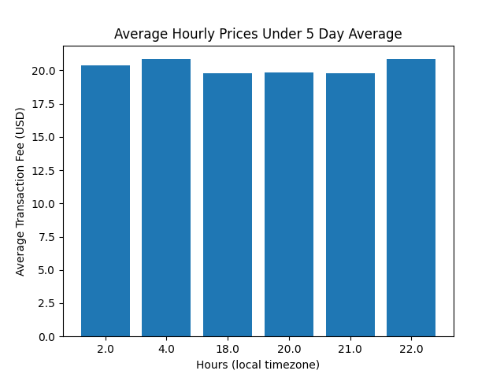

# ETH-Fee-Time-Tool
Find the best time to make ETH transactions!
Utilizing flipsidecrypto VELOCITY database: https://app.flipsidecrypto.com/shareable/timing-for-claiming-rewards-bqT2Cu 

## What is the best time to make your transaction?
This tool takes the average transaction fee (USD) over the past 5 days.
* Utilizing flipsidecrypto VELOCITY database to query transaction history which returns an average transaction fee in the hour.
* Reason for averaging over a longer period of time is because the *day of the week* can effect the average transaction fee. A 5-day period allows for a combination of weekedays and weekends while still representing current trends in the market. (see https://ethereumprice.org/gas/)

## Average Transaction Fee by the hour over the past 5 days

This on it's own is useful as it shows the hourly average transaction fees. Graphically we are able to see which hours have the lowest transaction fees. However, this can still be improved.

## Narrowing the search

We want to find the optimal time to stake and claim. The following graph shows only the hours that have average transaction fees under the overall average. 

